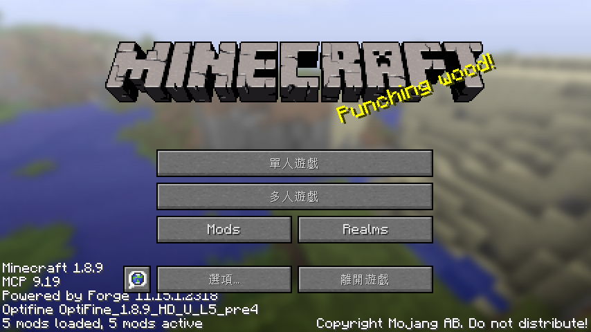

# ForceASCIIFont

Before Minecraft 1.13, if the language file of the corresponding language contains non-ASCII characters, all charactors will be rendered as unicode font style.

This mod will solve this issue.

## Screenshots

